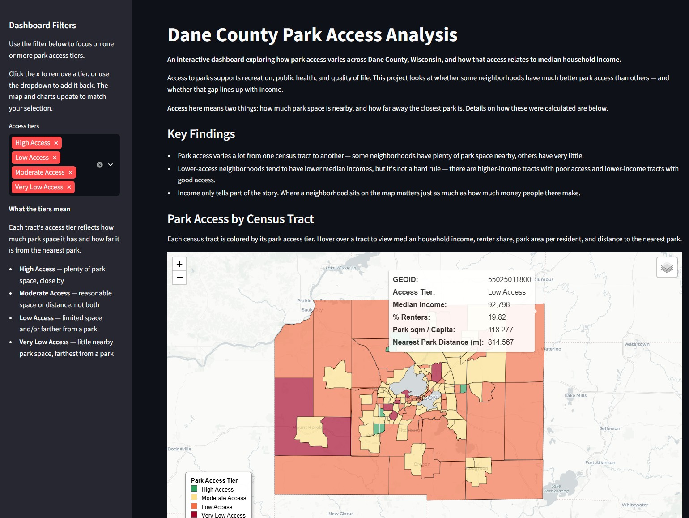
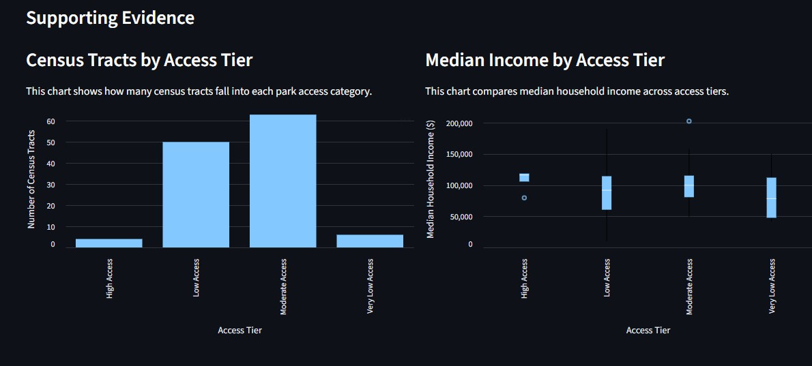
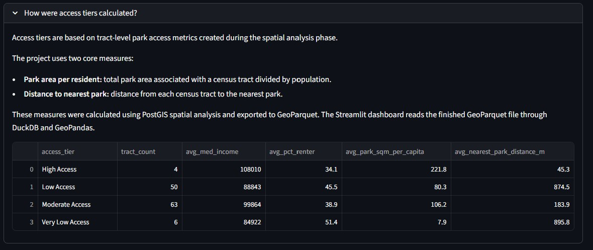

# Dane County Park Access Analysis



---

## Project Highlights

- Designed an end-to-end geospatial data pipeline using **PostGIS**, **DuckDB**, and **Streamlit**.
- Combined **U.S. Census American Community Survey (ACS)** data with **OpenStreetMap** park polygons.
- Calculated tract-level park accessibility metrics using spatial SQL.
- Published results as an interactive dashboard for exploring park accessibility across Dane County, Wisconsin.
- Organized the application using a modular architecture that separates data access, mapping, and user interface logic.

---

# Project Overview

Access to parks contributes to recreation, public health, and overall quality of life. However, park access is not distributed equally across all communities.

This project explores how park accessibility varies across census tracts in Dane County, Wisconsin, and examines whether neighborhoods with different median household incomes experience different levels of park access.

To support this analysis, I designed an end-to-end geospatial data pipeline that combines demographic data from the U.S. Census American Community Survey (ACS) with park polygons from OpenStreetMap. Spatial analysis was performed in PostGIS, analytical results were exported to GeoParquet, and an interactive Streamlit dashboard was developed to communicate the findings.

The project emphasizes not only spatial analysis, but also software architecture, reproducibility, and clear communication of analytical results.

---

# Research Questions

This project explores the following questions:

- How does park accessibility vary across Dane County census tracts?
- Do neighborhoods with lower median household incomes tend to have lower park accessibility?
- What spatial patterns emerge when park accessibility is mapped across the county?

Rather than attempting to build a predictive model, the goal is exploratory spatial analysis that helps visualize and understand geographic patterns in park accessibility.

---

# Dashboard

The final product is an interactive Streamlit dashboard that allows users to:

- Explore park access by census tract
- Filter census tracts by access tier
- Compare park accessibility with median household income
- Review supporting charts and summary statistics
- Understand the methodology used to calculate park access

The dashboard was intentionally designed to tell a story, guiding users from the research question to the supporting evidence while remaining approachable for non-technical audiences.

---

## Dashboard Overview


---

## Supporting Evidence



---

## Methodology



---

# System Architecture

One of the primary design goals was to separate **computationally intensive spatial analysis** from the interactive dashboard.

Instead of querying PostGIS every time a user loads the dashboard, all spatial analysis is performed once, exported to GeoParquet, and served through DuckDB.

```
Raw Data
    │
    ▼
PostGIS Spatial Analysis
    │
    ▼
GeoParquet Export
    │
    ▼
DuckDB Analytical Queries
    │
    ▼
Streamlit Dashboard
```

This architecture provides several advantages:

- expensive spatial analysis runs only once
- dashboard startup is fast
- deployment is simpler because no database server is required
- the analytical dataset becomes portable and reusable

---

# Engineering Decisions

Several architectural decisions were made to improve maintainability, portability, and performance.

| Decision | Reason |
|-----------|--------|
| **PostGIS** | Perform computationally intensive spatial analysis |
| **GeoParquet** | Store analysis results in a portable GIS format |
| **DuckDB** | Query analytical data without requiring a running database |
| **Streamlit** | Rapid development of an interactive analytical dashboard |
| **queries.py** | Separate SQL logic from the user interface |
| **map_utils.py** | Encapsulate Folium map creation and styling |
| **Cached data loading** | Improve dashboard responsiveness |
| **Modular project structure** | Simplify maintenance and future expansion |

The result is an application in which each component has a clearly defined responsibility:

- **PostGIS computes**
- **DuckDB serves**
- **Streamlit communicates**

This separation greatly simplified deployment while keeping the dashboard responsive.